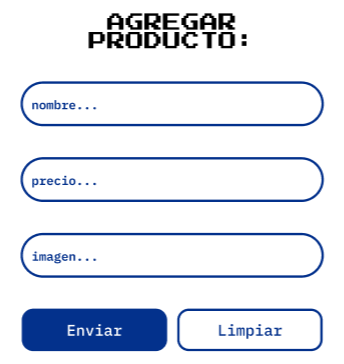
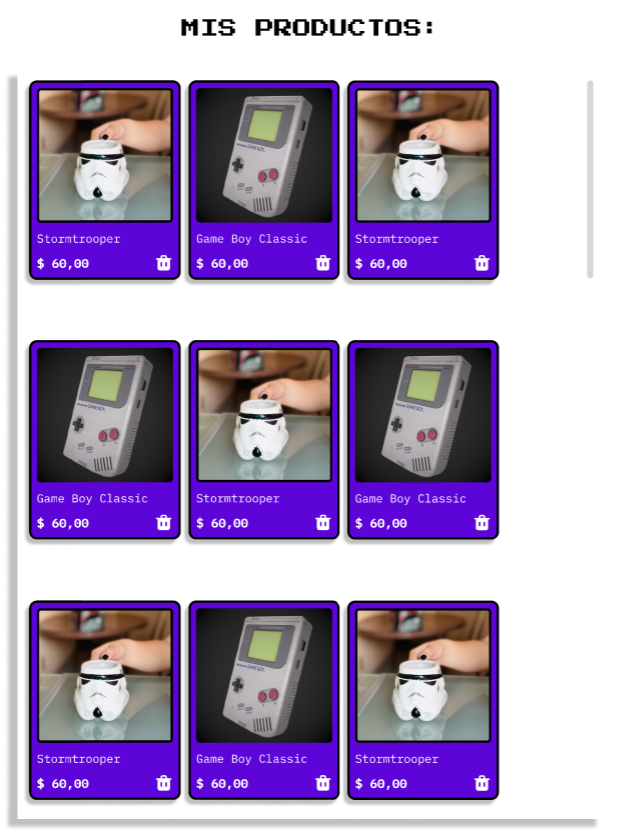

## AluraGeek / Leidy K

## Índice

* [Descripción del proyecto](#descripción-del-proyecto)

* [Estado del proyecto](#Estado-del-proyecto)

* [Características de la aplicación y demostración](#Características-de-la-aplicación-y-demostración)

* [Acceso al proyecto](#acceso-proyecto)

* [Tecnologías utilizadas](#tecnologías-utilizadas)

* [Personas-Desarrolladores del Proyecto](#personas-desarrolladores)

* [Conclusión](#conclusión)

## Descripción del proyecto

Es una aplicación para la practica del uso de JavaScript, HTML y CSS con el uso de la dependencia JSON server la cual sirve como servidor local para almacenar productos con un nombre, precio, una id única y una URLde la imagen del producto.

## Estado del proyecto

📚 Proyecto terminado  📚

## Características de la aplicación y demostración

En base a un diseño UI proporcionado por Alura Latam que puedes encontrar en [Figma](https://www.figma.com/design/r075aV1WMlDNNUbLxfpf7t/AluraGeek?node-id=0-1&t=ZnUNbDUGvFr7YBoh-0):

- `Funcionalidad 1`: Cuenta con un formulario el cual sirve para enviar los datos de los productos a la base de datos. Ejecuta una verificación de los campos para que puedas ver los productos correctamente una vez renderizados.

- `Funcionalidad 2`: Renderiza los productos enviados con los datos enviado desde el formulario trayéndolos desde el server local. Permitiendo tambien eliminar cualquier productos con hacer click en la caneca de basura.

## 📋 Acceso al proyecto

Para poder hacer uso del proyecto tienes que simular un servidor local y puedes hacer uso de [json-Server](https://www.npmjs.com/package/json-server) para ello es necesario de [Node.js](https://nodejs.org/en) así que descárgalos.

Crea una carpeta donde vas a crear un archivo .json 

`db.json`

Luego ejecuta el siguientes comandos en la terminal en la misma ruta donde esta el archivo anterior.

`npm init -y`

`npm install json-server`

`npx json-server --watch db.json --port 3001`

Ya hecho estos pasos puedes ver en funcionamiento la aplicación si no quieres clonar el proyecto.

## Que lenguajes usa este proyecto

- JavaScript
- HTML
- CSS
- json-server

## Más de mi

[ Leidy Korrea](https://github.com/Lkiut)

## Conclusión

Este proyecto fue desarrollado siguiendo los estilos propuestos por [Alura Latam](https://www.aluracursos.com/) como parte del programa [ONE - Oracle Next Education](https://www.oracle.com/co/education/oracle-next-education/) para la ruta de Front-end Colombia 2024

